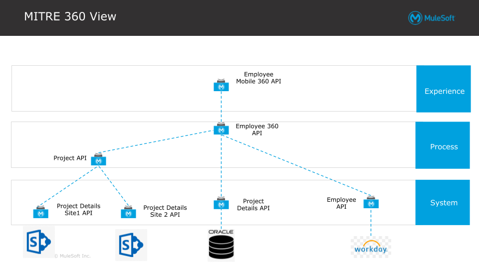

# HR_EMPLOYEE360_MITRE

### Status
```diff
- In Construction

! Need to provide a SQL script to autopopulate Oracle DB 
```
## Overview
This use case addresses the common Employee360 problem. Our customer had employee data stored across various systems. These were; Workday, Sharepoint, and Oracle DBs. A digital transformation initiative was underway to optimize employee utilization against ongoing and new projects. To do so, the customer needed a way to consolidate the employee data stored across various systems and create a single source of truth, the Employee360.  

This demo proves how the MuleSoft api-led POV addresses this problem while being faster to deployment, and providing a future proof architecture.

### Architectural Overview



## Getting Started

1. Clone this project
2. Modify the src/main/resources/config.yaml with the correct credentials
3. Run locally
3. Call the APIs using postman
	* Import the attached docs/employee_360_workday_sp_oracle.postman_collection.json into postman.
